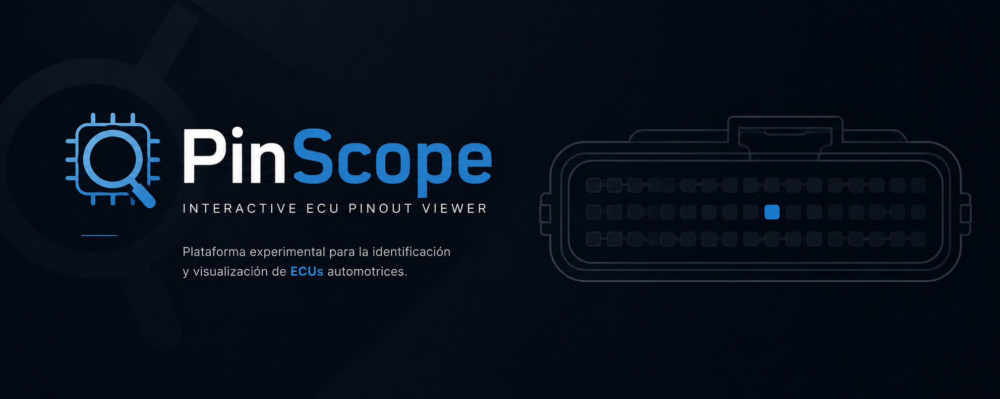
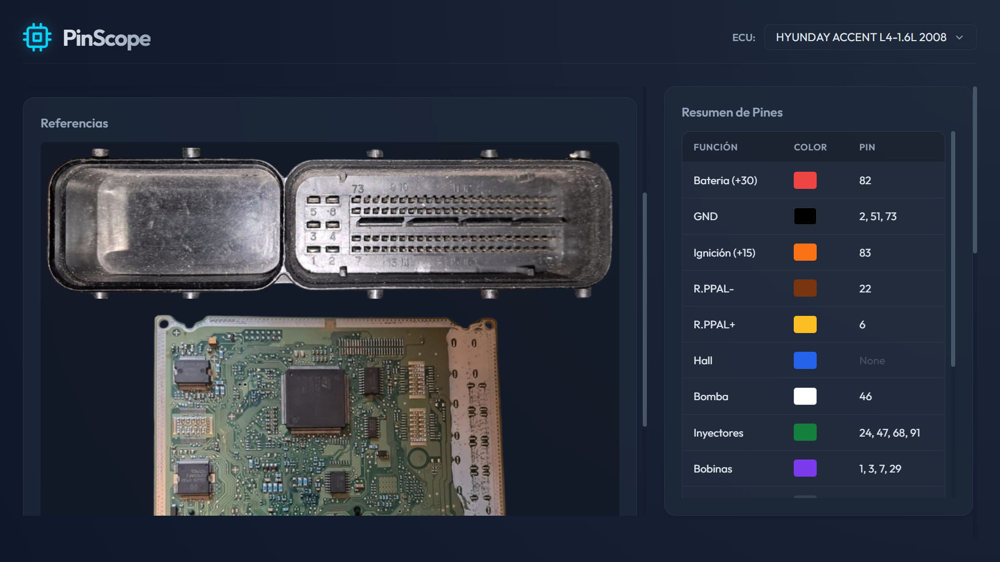
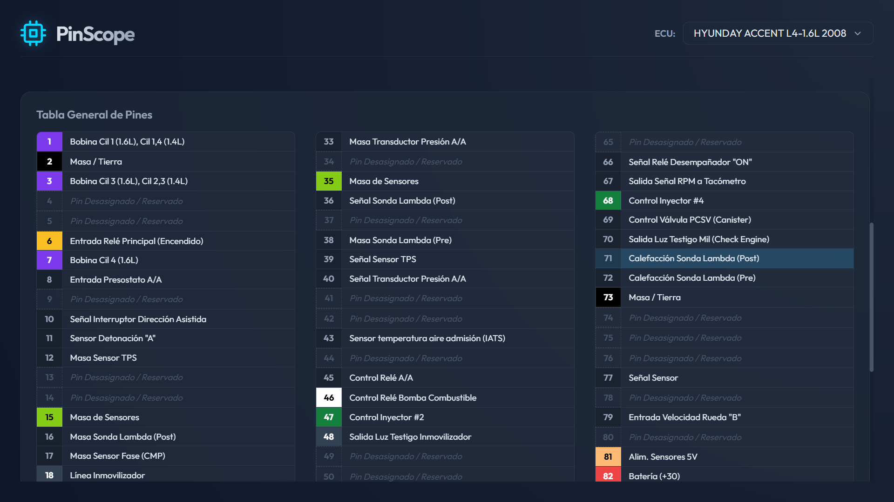
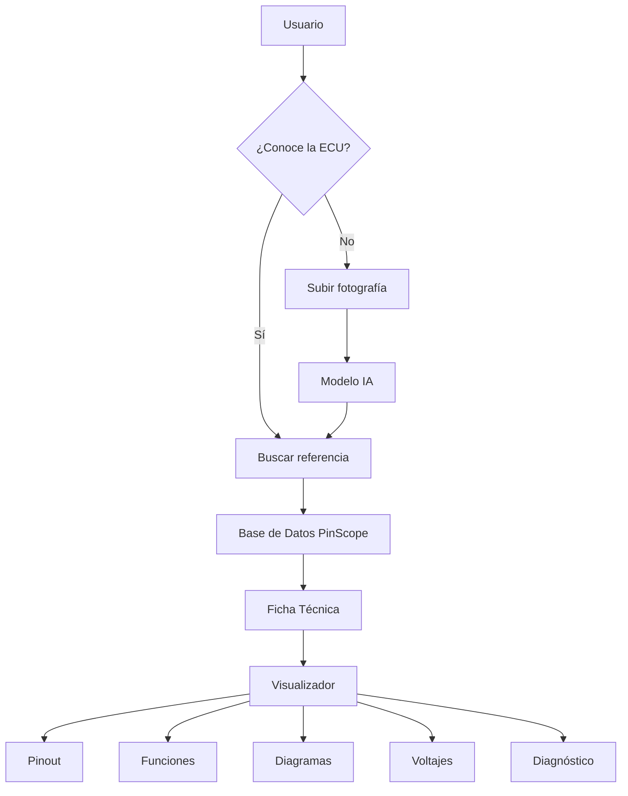

<p align="center">
  
</p>

<h1 align="center">PinScope</h1>

<p align="center">
<b>Plataforma Experimental para la Identificación y Visualización de ECUs Automotrices</b>
</p>

<p align="center">
PinScope es la primera iteración de una plataforma orientada a la documentación, identificación y consulta interactiva de unidades de control electrónico (ECUs). Actualmente funciona como un prototipo funcional que valida la experiencia de usuario y la visualización de pinouts, sentando las bases para una futura plataforma SaaS especializada en electrónica automotriz.
</p>

<p align="center">


</p>

<br>

# 📑 Índice

- 📖 Descripción
- 💡 Origen del Proyecto
- 🎯 Objetivo
- ✨ Características
- 📸 Vista previa
- ⚙ Funcionamiento Actual
- 🚀 Visión del Proyecto
- 📊 Arquitectura
- 📈 Flujo Propuesto
- 🛠 Tecnologías
- 📂 Estructura
- 🚧 Estado del Proyecto
- 🔮 Futuro del Proyecto
- 👨‍💻 Autor

<br>

# 📖 Descripción

**PinScope** nació como un experimento para desarrollar una plataforma capaz de visualizar de forma interactiva la distribución de pines de unidades de control electrónico (ECUs).
Actualmente funciona como una demostración técnica utilizando una ECU documentada manualmente, permitiendo explorar la interfaz, la organización de la información y la experiencia de usuario.

Más que un proyecto estatico, PinScope representa la base conceptual para una plataforma de documentación automotriz mucho más ambiciosa.

<br>

# 💡 Origen del Proyecto

PinScope fue desarrollado inicialmente como un experimento para explorar las capacidades del desarrollo asistido por Inteligencia Artificial.
El objetivo era comprobar hasta qué punto era posible construir una aplicación funcional utilizando una única interacción extensa con un modelo de IA, complementada posteriormente con ajustes manuales.
El resultado fue un prototipo completamente funcional que permitió validar la idea principal del proyecto.

<br>

# 🎯 Objetivo

PinScope busca centralizar la información técnica de ECUs automotrices mediante una plataforma accesible desde cualquier navegador.
La visión del proyecto es ofrecer una herramienta capaz de:

- 📌 Consultar pinouts interactivos.
- 🔍 Buscar ECUs por fabricante, referencia o vehículo.
- 📷 Identificar módulos mediante imágenes.
- 🤖 Incorporar reconocimiento asistido por IA.
- 📊 Mostrar diagramas y documentación técnica.
- ☁️ Acceder a la información desde cualquier dispositivo.

<br>

# ✨ Características actuales

- ✅ Visualización gráfica del conector.
- ✅ Distribución completa de los pines.
- ✅ Panel informativo por pin.
- ✅ Interfaz moderna.
- ✅ Navegación rápida.
- ✅ Diseño Responsive.
- ✅ Base demostrativa con una ECU.

<br>

# 📸 Vista previa

<p align="center">


</p>

<br>

# ⚙ Funcionamiento Actual

Actualmente el proyecto utiliza una única ECU registrada manualmente.

El flujo actual es el siguiente:

```text
Usuario

↓

Selecciona ECU disponible

↓

Visualización interactiva

↓

Selecciona un pin

↓

Consulta información técnica
```

Toda la información está escrita manualmente dentro del proyecto.

Esto permitió validar la experiencia de usuario antes de diseñar un sistema escalable.

>La versión actual implementa una única ECU documentada manualmente. Este enfoque permitió validar el funcionamiento del visualizador antes de diseñar una arquitectura escalable basada en una base de datos centralizada.


<br>

# 🚀 Visión del Proyecto

La versión actual representa únicamente el primer paso del ecosistema PinScope.

La evolución prevista transforma el proyecto en una plataforma SaaS especializada en documentación e identificación de ECUs automotrices.

La plataforma integrará:

- 🤖 Reconocimiento mediante Inteligencia Artificial.
- 📷 Identificación automática por fotografía.
- 🗄 Base de datos dinámica.
- 🚗 Compatibilidad con múltiples fabricantes.
- 📊 Visualización interactiva de pinouts.
- ⚡ Diagramas eléctricos.
- 📈 Valores de referencia.
- 🔎 Historial de fallas frecuentes.
- 👥 Plataforma colaborativa para técnicos.
- ☁️ Acceso mediante suscripción desde cualquier dispositivo.

<br>

# 📊 Arquitectura Actual

```text
Repositorio

│

├── HTML

├── CSS

├── JavaScript

│

└── ECU (Estática)

        │

        ▼

Visualizador

        │

        ▼

Consulta de Pines
```

<br>

# 📈 Flujo Propuesto (Evolución)



Este flujo representa la evolución prevista para el proyecto y no la implementación actual.

<br>

# 🛠 Tecnologías

| Categoría | Tecnología |
|------------|------------|
| Frontend | HTML5 |
| Estilos | CSS3 |
| Lógica | JavaScript |
| Diseño | Glassmorphism |
| Estado | Proof of Concept |

<br>

# 📂 Estructura

```text
PinScope/

│

├── css/

├── js/

├── img/

├── data/

├── index.html

└── README.md
```

<br>

# 🚧 Estado del Proyecto

| Característica | Estado |
|----------------|:------:|
| Interfaz | ✅ |
| Visualizador | ✅ |
| ECU demostrativa | ✅ |
| Consulta de pines | ✅ |
| Base de datos dinámica | ❌ |
| Reconocimiento IA | ❌ |
| Soporte múltiples ECUs | ❌ |

🟡 **Estado General:** Proof of Concept

Este proyecto se encuentra archivado como prototipo experimental.

<br>

# 🔮 Futuro del Proyecto

Las siguientes características representan la evolución planteada para PinScope.

- 🤖 Reconocimiento mediante IA.
- 📸 Identificación automática por fotografía.
- 🗄 Base de datos dinámica.
- 🚗 Compatibilidad con cientos de ECUs.
- 🔍 Motor de búsqueda avanzado.
- 📊 Diagramas eléctricos.
- ⚡ Voltajes esperados por pin.
- 📚 Información técnica completa.
- 🌐 Plataforma web.

<br>

# 💭 Reflexión

PinScope demostró que era posible construir una herramienta funcional para la consulta visual de ECUs.

Aunque el desarrollo no continuó, el proyecto permitió validar la interfaz, la experiencia de usuario y el potencial de una futura plataforma basada en Inteligencia Artificial para el reconocimiento automático de módulos electrónicos automotrices.

Hoy continúa como un **Proof of Concept**, dejando planteada una arquitectura sólida para una futura versión escalable.

<br>

# 👨‍💻 Autor

**Samuel Durán Cárdenas**

Desarrollador Full Stack

Intereses:

- 💻 Desarrollo Web
- 🤖 Inteligencia Artificial
- 🚗 Electrónica Automotriz
- 🎮 Desarrollo de Videojuegos
- ⚡ Sistemas Embebidos

<br>

<p align="center">
<b>💡 Un prototipo no siempre representa un producto terminado; muchas veces representa el inicio de una gran idea.</b>
<br><br>
⭐ Si este proyecto te resultó interesante, considera dejar una estrella al repositorio.
</p>